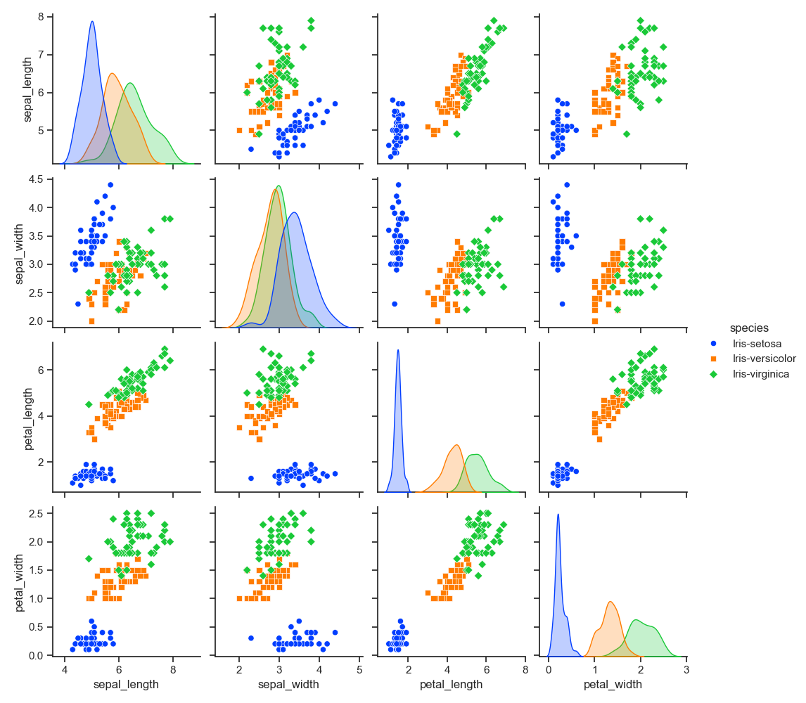
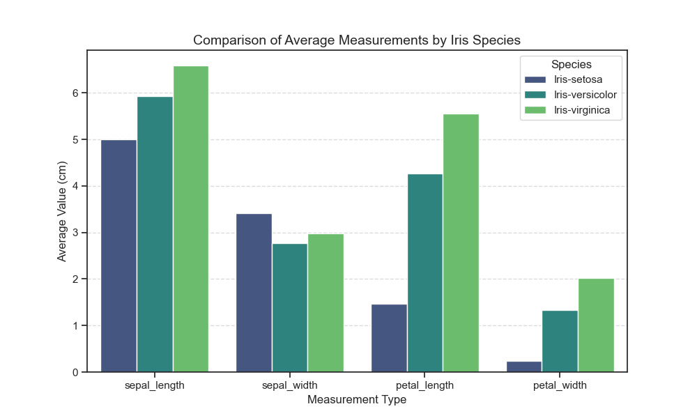
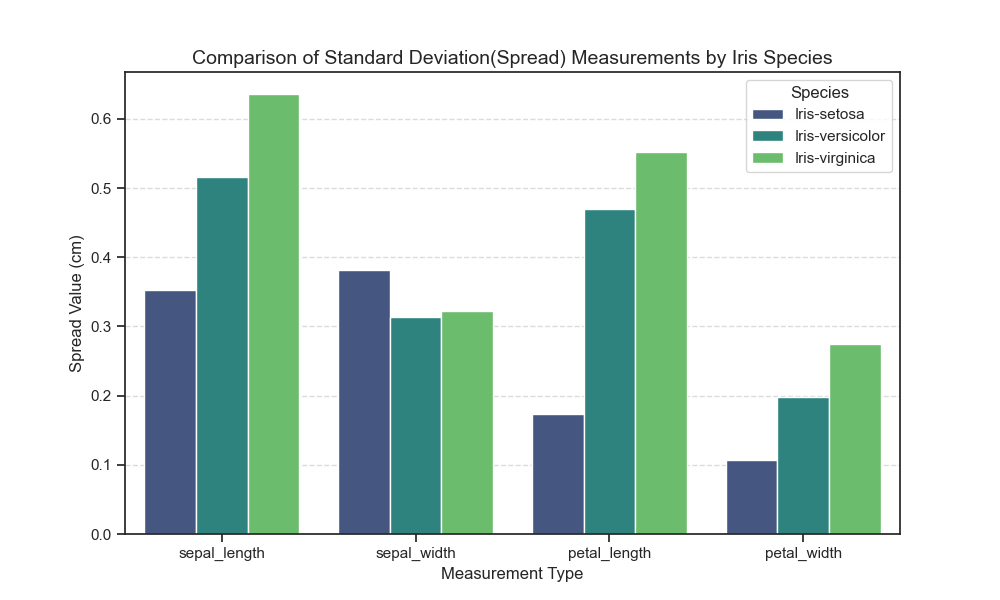
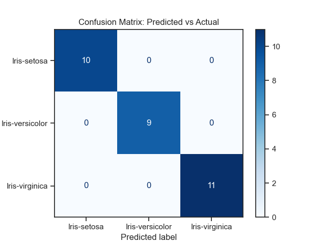

# Data Science Internship Projects by Gaurav Gyansu

This repository is for my Data Science Internship at Codsoft.
### email : gyansu75@gmail.com 

---

# Iris Flower Species Classification

## 📌 Project Overview
This project focuses on the classic Iris classification problem, a fundamental task in supervised machine learning. The goal is to build a model that can accurately predict the species of an Iris flower based on its morphological measurements (sepal and petal dimensions).

## 📊 Dataset Description
The Iris Dataset contains 150 records under 5 attributes:
- **Sepal Length** (cm)
- **Sepal Width** (cm)
- **Petal Length** (cm)
- **Petal Width** (cm)
- **Species**: Iris-setosa, Iris-versicolor, Iris-virginica

Each species has 50 observations, providing a perfectly balanced dataset for training.

## 🛠️ Methodology

### 1. Exploratory Data Analysis (EDA)
Before modeling, we analyzed the physical characteristics of each species:
- **Visual Exploration**: Generated **Pair Plots, Bar Charts** to identify feature correlations and species separation.
- **Statistical Profiling**: Calculated Mean and Spread measurements to define the unique "fingerprint" of each species.
- **Key Findings**: Petal measurements show significantly higher separation between species than sepal measurements, particularly for *Iris-setosa*.

---
### 2. Model Development
- **Algorithm**: Logistic Regression (chosen for its efficiency and interpretability in classification tasks).
- **Data Split**: 80% Training / 20% Testing.
- **Scaling**: Standardized features to ensure optimal convergence (where applicable).

---
### 3. Evaluation and Testing
The model achieved an **Accuracy of 100%** on the test set. Performance was validated using:
- **Accuracy Score**: The ratio of correctly predicted observations.
- **Confusion Matrix**: Confirmed zero misclassifications across all three categories.

---
## 📈 Key Visualizations
- **Bar Comparison**: A breakdown of average dimensions showing that *Iris-virginica* is generally the largest, while *Iris-setosa* is the smallest with the widest sepals.
- **Confusion Matrix**: A heat-mapped visual showing perfect alignment between predicted and actual labels.

---
## 📈 Results and Predictions
 - **Iris-setosa** - 10
 - **Iris-versicolor** - 9
 - **Iris-virginica** - 11

  **Note** : These are actual results as the Standard Deviation was below 0.7 for all features used for classification due to which 100% accuracy was achieved by the model.

---
## Tools and Softwares
- **Platforms:** Jupyter, Github
- **Programming languages:** Python+3.8
- **Libraries:** Matplotlib, Seaborn, Scikit-learn, Pandas

---
**Author:** Gaurav Gyansu 
**Role:** Data Science Intern

---

