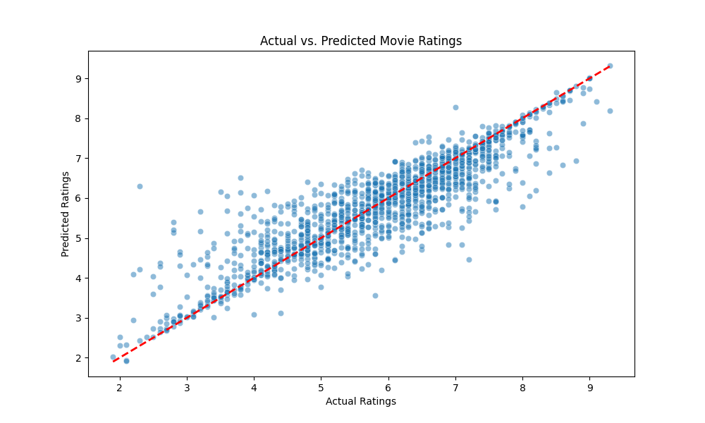
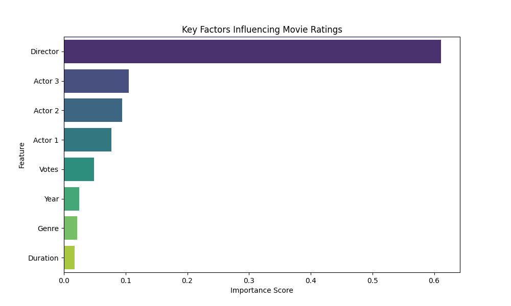

# Data Science Internship Projects by Gaurav Gyansu
This repository is for my Data Science Internship at Codsoft.
### email : gyansu75@gmail.com 
---
# Movie Rating Prediction with Python 🎬

## 📌 Project Overview
This project aims to estimate the IMDb ratings of Indian movies using historical data. As a Data Science Intern project, the goal was to analyze which factors—such as **Director**, **Genre**, or **Lead Actors**—most significantly influence the audience's perception and the overall success of a film.

By applying regression techniques, this model can predict a movie's rating before it even hits the theaters, providing valuable insights for production houses and distributors.

## 📊 Dataset
The analysis is based on the **IMDb Movies India.csv** dataset, which contains:
*   **Name:** The title of the movie.
*   **Year:** Release year.
*   **Duration:** Total runtime.
*   **Genre:** Category (Action, Drama, etc.).
*   **Rating:** The target variable (IMDb score).
*   **Votes:** Number of user reviews.
*   **Director & Actors:** The creative talent behind the film.

## 🛠️ Technical Workflow
1.  **Data Preprocessing:** 
    *   Cleaned missing values and handled non-numeric strings in the `Year` and `Duration` columns.
    *   Standardized the `Votes` column for numerical consistency.
2.  **Feature Engineering:**
    *   Implemented **Mean Encoding** (Target Encoding) for categorical variables like `Director` and `Actor`. This converted creative talent into statistical impact scores.
3.  **Model Making:**
    *   Utilized a **Random Forest Regressor** to capture non-linear relationships between features.
    *   Split data into **80% Training** and **20% Testing** sets to ensure model generalizability.
4.  **Evaluation and Testing:**
    *   Assessed performance using **R-squared (R2)** and **Mean Squared Error (MSE)** methods.
    *   We also compared Actual Ratings with the Predicted Ratings and plotted a chart to analyze the variations between them.

## 📈 Results
*   **Mean Squared Error:** [0.38] This should be near to 0 for a good prediction
*   **R-squared Score:** [0.80] This should be near to 1 for a good prediction ( >= 0.80 is considered fair prediction )
*   **Key Insight:** Our model revealed that the **Director's track record** and the **number of Votes** (popularity) are the strongest predictors of a movie's final rating.

## Tools and Softwares
- **Platforms:** Jupyter, Github
- **Programming languages:** Python
- **Libraries:** Matplotlib, Seaborn, Scikit-learn, Pandas, Numpy

---
**Author:** [Gaurav Gyansu]  
**Role:** Data Science Intern

---
